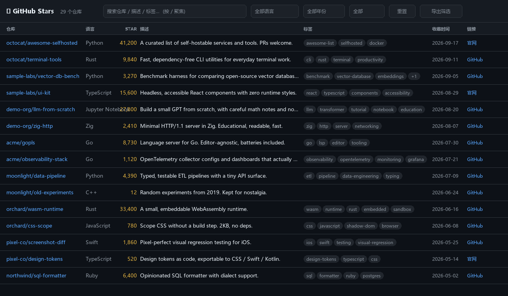

# gh-stars

[](LICENSE)
[](https://www.python.org/)

把 GitHub Star 的项目导出成 **CSV / Markdown / 可搜索的单文件 HTML**。

> 起因：Star 攒到 1000+ 之后，GitHub 自带的 Stars 页面基本没法用了 —— 找不着、搜不到、不能按语言筛。这个工具走官方 API 把数据全捞下来，落成能离线翻的表格。



> 上图为 `--demo` 假数据渲染的效果，不是任何人的真实 Star 列表。

## 特性

- **走官方 API**，自动翻页，不爬 HTML，不会触发风控
- **CSV 带 BOM**，Excel / WPS 双击直接开，中文和 Emoji 不乱码
- **单文件 HTML**，数据内嵌，断网可用；支持实时搜索（命中高亮）、按语言/年份/归档状态筛选、点列头排序、长描述点击展开、把筛选结果再导出成 CSV
- **能处理脏数据**：自动折叠全角空格之类的异常空白，超长描述分格式截断
- **零第三方依赖**，只用 Python 标准库 + `gh` CLI

## 依赖

| 依赖 | 说明 |
|---|---|
| [gh CLI](https://cli.github.com/) | 需已登录（`gh auth login`），负责请求和分页 |
| Python 3.8+ | 只用标准库，**不需要** `pip install` |

## 快速开始

```bash
# 不想登录？先用内置假数据看看长什么样
python stars.py --demo -o demo.csv --all

gh auth login          # 只需一次

# 方式一：直接指定用户名
python stars.py --user YOUR_NAME --all

# 方式二：写进本地配置，之后不用每次带参数（推荐）
echo YOUR_NAME > .stars-user
python stars.py --all
```

`--all` 会在 CSV 旁边额外生成同名的 `.md` 和 `.html`。

Windows 下可以直接双击 `update-stars.bat`，它会重新拉取并打开 HTML：

```bat
update-stars.bat              REM 用 .stars-user 或当前登录账号
update-stars.bat YOUR_NAME    REM 临时指定用户名
```

导出对象依次取：`--user` 参数 → 同目录 `.stars-user` 文件 → 当前 `gh` 登录账号。

## 参数

| 参数 | 说明 |
|---|---|
| `-o, --output` | CSV 输出路径，默认 `github-stars.csv` |
| `--user NAME` | 导出指定用户的**公开** Star；省略时看 `.stars-user` |
| `--account NAME` | 用哪个 `gh` 账号的 token（多账号场景） |
| `--all` | 等价于 `--md --html` |
| `--md` | 生成同名 Markdown 表格 |
| `--html` | 生成同名可搜索 HTML |
| `--from-csv FILE` | **不调 API**，直接读已有 CSV 重建 md/html |
| `--demo` | 用内置假数据生成样例（截图 / 演示 / 无网络试跑，不调 API） |
| `--max-desc N` | 描述截断长度（字符），默认 **500**；`0` = 不截断 |
| `--sort` | 排序字段：`starred_at`(默认，倒序) / `stars` / `full_name` / `language` |

## 输出

以 `-o stars.csv` 为例：

| 文件 | 说明 |
|---|---|
| `stars.csv` | UTF-8 BOM，一行一个仓库 |
| `stars.md` | Markdown 表格，链接可点，可丢进仓库当 awesome-list |
| `stars.html` | 单文件应用，双击用浏览器打开 |

CSV 列：收藏时间、仓库、语言、Star 数、描述、标签、链接、官网、已归档、是Fork、协议、创建时间、最后提交。

## 刷新数据

双击 `update-stars.bat`（重新拉取 → 覆盖三个产物 → 自动开浏览器），或者直接重跑命令：

```bash
python stars.py -o stars.csv --all
```

HTML 是快照，刷新后浏览器里如果还是旧的，按 `Ctrl+F5` 强刷。

## 关于 API 限额

认证后限额是 **5000 次/小时**，而全量重拉 1000 个 Star 只需 **11 次请求**（100/页），占 0.22%，耗时几十秒。

要撞到限额得在一小时内连续刷新几百次。所以**没有任何增量逻辑，无脑全量重拉就行**，不值得为它做缓存。

> 如果哪天 Star 数涨到十万级，再考虑增量：`/user/starred` 默认按收藏时间倒序，翻到第 1 页全是已有记录就可以停，日常更新只要 1 次请求。

## 关于超长描述

有的仓库会在描述里塞几千个全角空格（U+3000）或者干脆塞几十 KB 垃圾（典型是 SEO 堆砌的书单仓库）。实测遇到过单条描述 **5 万多字符**，折叠前能把表格直接撞爆。

处理方式分两层：

1. **所有输出**都会先把空白折叠成单个半角空格（含 `U+3000`、`U+00A0`），换行也一并拍平
2. **CSV / Markdown** 再按 `--max-desc`（默认 500）截断，超出加 `…`
3. **HTML 保留全文**，默认只显示前 500 字，后面跟一个 `展开 (55,332 字)` 的链接，点一下看全文

> ⚠️ 因为 CSV 里存的是截断后的文本，用 `--from-csv` 重建的 HTML 拿不回被截掉的全文 —— **想要全文展开功能就走 API 拉**。
>
> GitHub 自己的描述上限是 350 字符，所以默认 500 基本不会误杀正常仓库。

## 改模板

只调 CSS / JS 时不想反复请求 API：

```bash
python stars.py --from-csv stars.csv --md --html
```

注意 `--from-csv` 且没指定 `-o` 时，**CSV 会被原样重写一遍**（内容无损，只是重新格式化）。

## 文件结构

```
gh-stars/
├── stars.py              # 主脚本：拉取 / CSV / Markdown / HTML
├── stars_template.html   # HTML 模板，占位符 __STARS_DATA__ / __MAX_DESC__
├── update-stars.bat      # Windows 一键刷新
├── .stars-user           # 本地用户名（gitignored）
├── LICENSE
├── README.md
├── docs/
│   └── screenshot.png    # README 里的界面截图
└── stars.{csv,md,html}   # 生成的数据（gitignored）
```

## 备注

- 导出别人账号时只能拿到**公开** Star。导出自己的私有 Star 需要 token 带 `user` 权限：`gh auth refresh -h github.com -s user`
- Windows 上 `gh api /user/starred` 直接在 Git Bash 里跑会被 MSYS 把路径改写成 `C:/Program Files/Git/...`，所以脚本里用 Python 的 `subprocess` 调用、不经过 shell。手动测试时把开头的 `/` 去掉即可。

## License

[MIT](LICENSE) © iroha3
